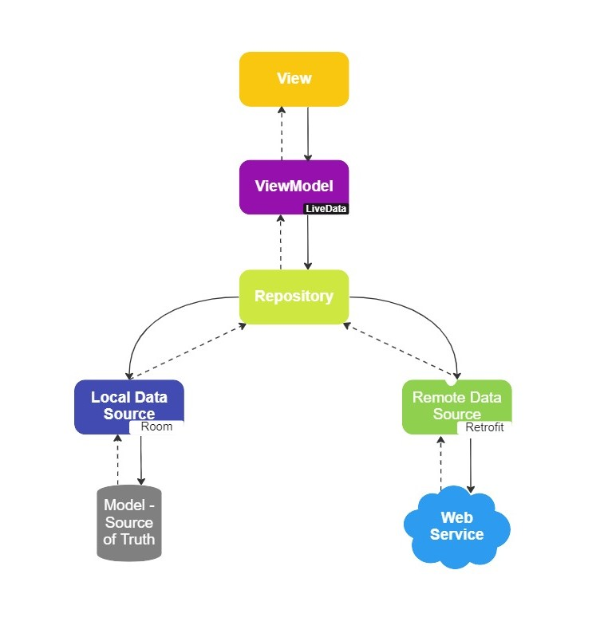
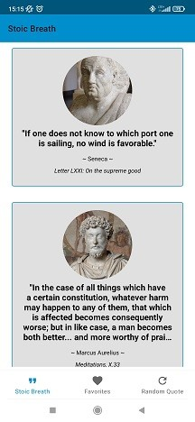
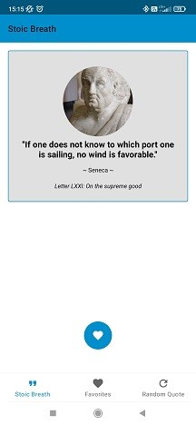
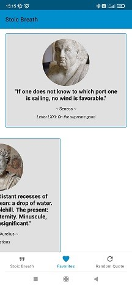
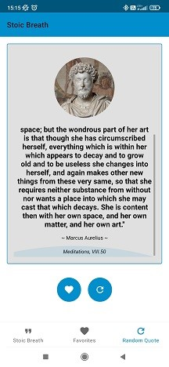
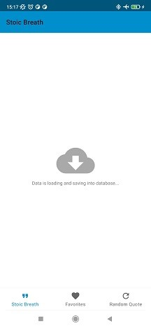
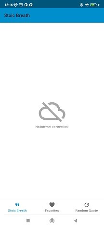

# Stoic Breath

### Goal
This is an application to let user get acquainted with stoic thoughts.

There are two main goals of creating this application:
1. Deliver tool, that users can study stoics' thoughts, save their favorites quotes, inspire, find a wisdom.
2. Practice coding, among others: MVVM, Room, API, Retrofit, Navigation Component, Fragments, ViewModel,
View Binding, LiveData, Coroutines, Third Party Library, Gradle etc.

### Architecture

### Screenshots

### Overview
This application gets more than 1000 quotes from API and saves it in the database.
User is able to:
1. See a list of all quotes,
2. Go to a single quote,
3. Add them to favorites or delete them from database,
4. Draw a random quote.

### Thank you

- [Philipp Lackner](https://pl-coding.com/)
- [Florian Walther](https://codinginflow.com/)
- [Flaticon - free icons](https://www.flaticon.com/free-icons/android) - [App icon source](https://github.com/maciejglownia/Stoic-Breath/blob/739493d76184a62b2b8ae9ae9041450fd76a73e2/app/src/main/assets/sources.txt)
- [Wikipedia](https://en.wikipedia.org/wiki/Main_Page) [Stoic images source](https://github.com/maciejglownia/Stoic-Breath/blob/739493d76184a62b2b8ae9ae9041450fd76a73e2/app/src/main/assets/sources.txt)
- [Miro - architecture diagram](https://miro.com/)

### Dear Visitor
If you see an opportunity to improve my code do not hesitate to contact me:
maciej.k.glownia@gmail.com. If you want to copy it and develop with your own idea, take it and enjoy
learning path.
